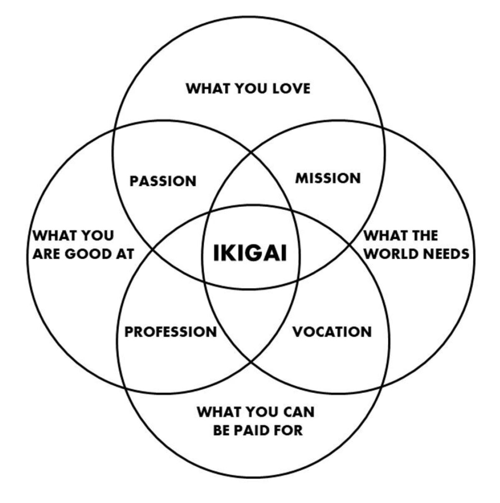

**Ikigai** (生き甲斐) is often translated as "reason for being" or "that which makes life worth living." It's the sense of purpose that gets you out of bed in the morning.

## The Four Circles

In popular use, ikigai is pictured as the overlap of four areas:

1. **What you love** (passion)
2. **What you're good at** (skill)
3. **What the world needs** (mission)
4. **What sustains you** (livelihood)

The sweet spot isn't one of these alone but where they meet. Work or life that feels meaningful, useful, and aligned with your strengths.

## The Western Misinterpretation

The Venn diagram version of ikigai is actually a Western invention[^1]. In Japan, the concept is broader and less career-focused. A retired grandmother who tends her garden every morning has ikigai. A child building with blocks has ikigai. It doesn't require monetization or world-changing impact.

[^1]: The four-circle Venn diagram often attributed to ikigai was created by Marc Winn in 2014, combining ikigai with a separate framework by Andres Zuzunaga. It's useful but not authentically Japanese.

The original meaning is closer to "the feeling that life is worth living." Neuroscientist Ken Mogi describes five pillars of ikigai[^2]:

- Starting small
- Accepting yourself
- Connecting with others and the world
- Seeking small joys
- Living in the here and now

[^2]: Ken Mogi, *The Little Book of Ikigai* (2017).

## Finding Your Own

The idea is less about a single "calling" and more about paying attention to the small things that give you satisfaction: a walk, a conversation, a project that uses your skills, or the rewards of [continuous improvement](posts/kaizen/index.md).

> [!tip] A practical exercise
> Write down three moments from the past week where you lost track of time. What were you doing? Who were you with? Those are clues.

In that sense, ikigai is something you notice and nurture through how you spend your time, not something you discover once and keep forever.

## Ikigai and Knowledge Work

For those of us who work with ideas, ikigai often shows up in the process itself. The act of writing a clear sentence, solving a tricky problem, or helping someone understand something new. These are small moments of purpose that compound over time.

Building a system that supports this kind of work, like a [second brain](posts/building-a-second-brain/index.md), is itself a form of ikigai. The system serves the purpose. The purpose feeds the system.
