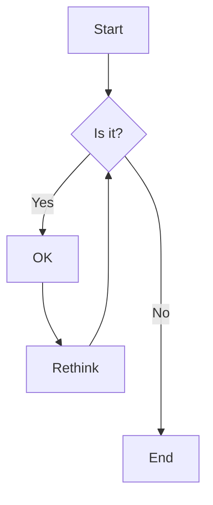
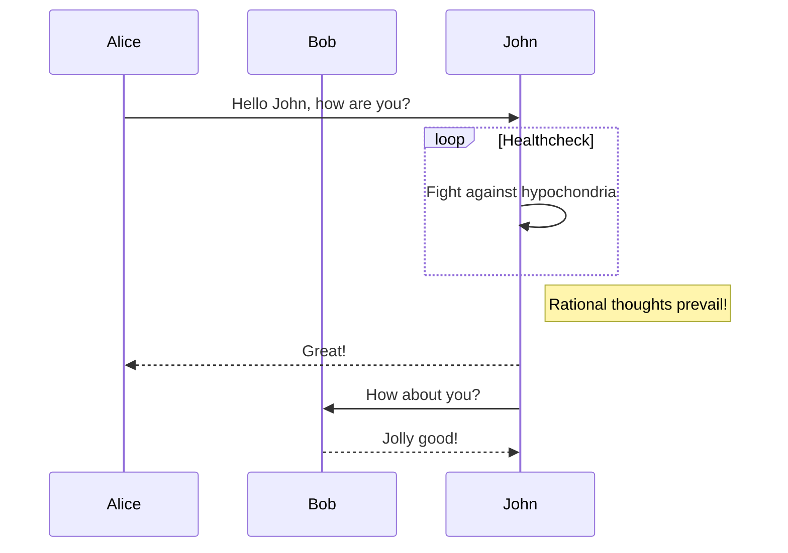
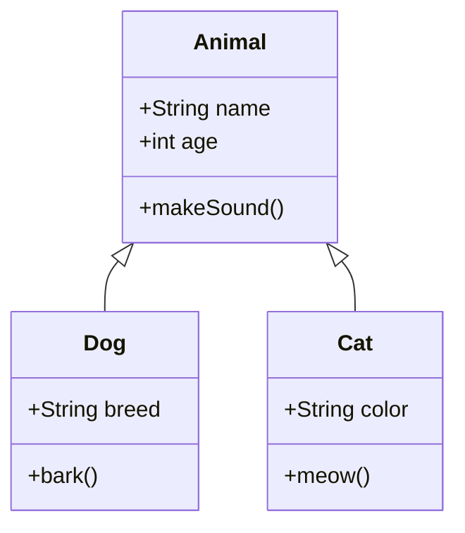
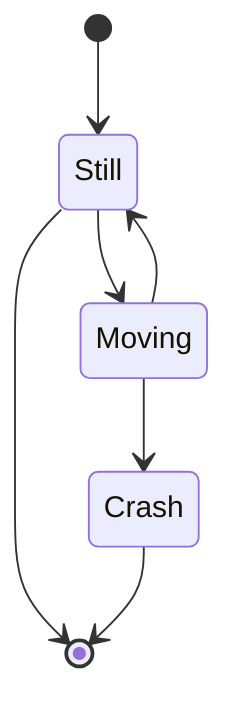
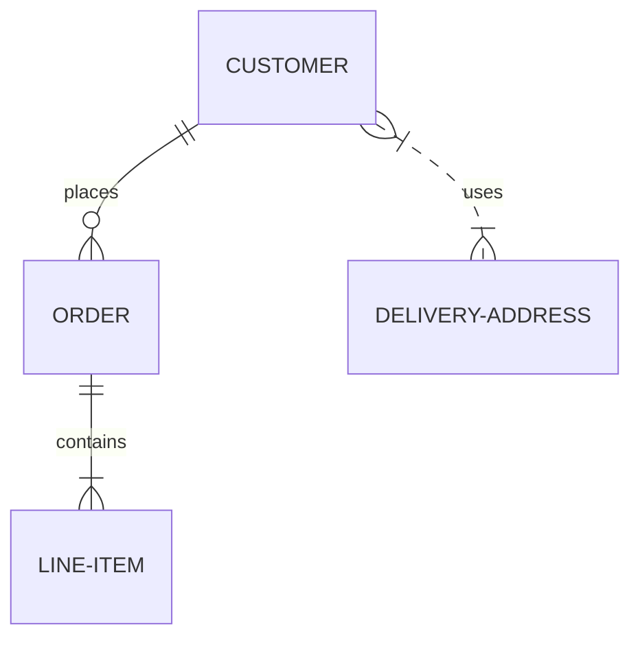
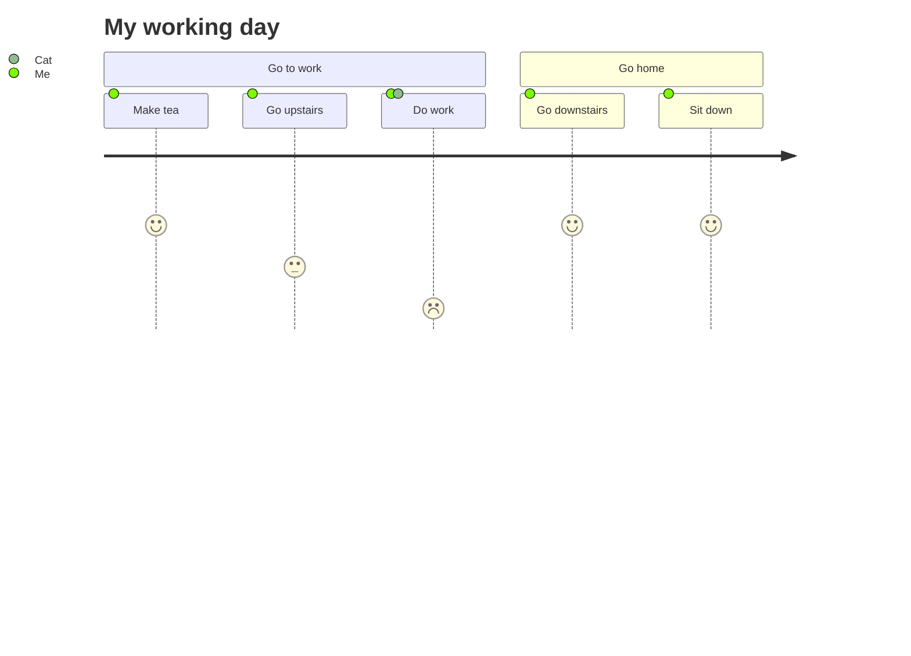
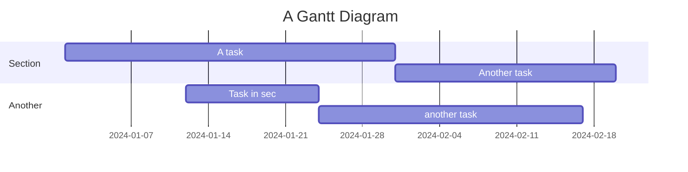
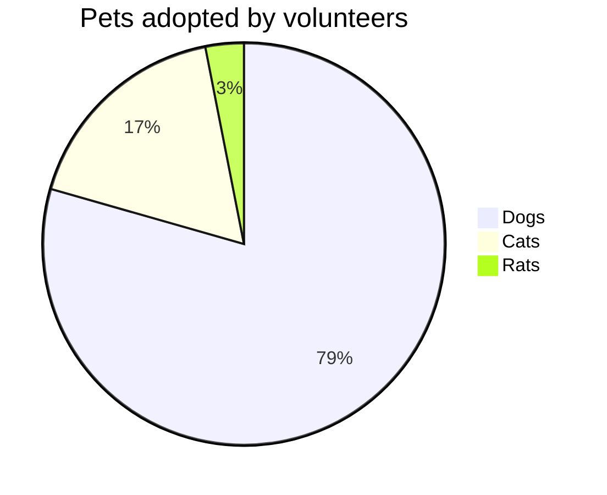
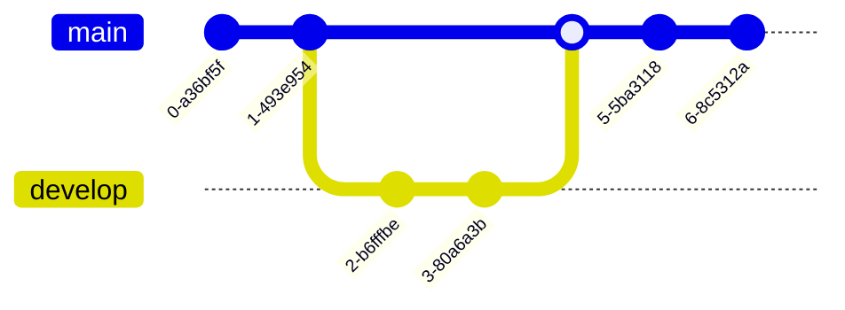
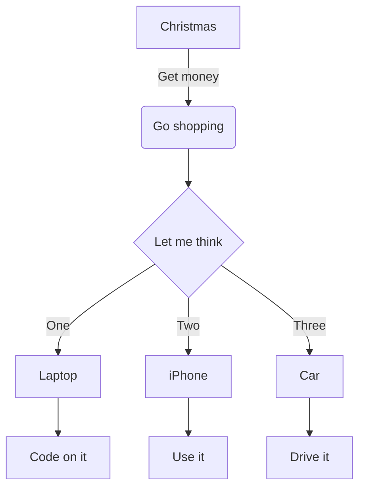

This post showcases the advanced embed features available in Axis, including media embeds, auto-embeds, math rendering, and Mermaid diagrams.

## Auto-embeds

### YouTube Videos

YouTube URLs are automatically embedded as responsive video players. Just paste a standard YouTube link as a markdown image:


```markdown

```

### Twitter/X Posts

Twitter/X post URLs are automatically embedded with theme-aware styling that matches your site's light/dark mode:


```markdown

```

## Media Embeds

Axis supports embedding local media files directly in your posts using standard markdown image syntax. Just place the files in your post's folder and reference them.

### Video


```markdown

```

### Audio


```markdown

```

### PDF


```markdown

```

## Math

Axis includes comprehensive LaTeX math support using KaTeX. All math works seamlessly in both light and dark themes.

### Inline Math

Use single dollar signs for inline math: $E = mc^2$ or $\int_0^{2\pi} d\theta x+e^{-i\theta}$.

### Display Math

Use double dollar signs for centered display math:

$$
\begin{vmatrix}a & b\\
c & d
\end{vmatrix}=ad-bc
$$

$$
f(x) = x^2 + 3x + 2
$$

### Common Mathematical Notation

#### Fractions and Superscripts
- Fractions: $\frac{a}{b}$, $\frac{x^2 + 1}{x - 1}$
- Superscripts: $x^2$, $e^{i\pi} + 1 = 0$
- Subscripts: $x_1$, $H_2O$

#### Greek Letters
- $\alpha, \beta, \gamma, \delta, \epsilon, \theta, \lambda, \mu, \pi, \sigma, \phi, \omega$
- $\Gamma, \Delta, \Theta, \Lambda, \Pi, \Sigma, \Phi, \Omega$

#### Mathematical Symbols
- Summation: $\sum_{i=1}^{n} x_i$
- Product: $\prod_{i=1}^{n} x_i$
- Integral: $\int_{-\infty}^{\infty} e^{-x^2} dx = \sqrt{\pi}$
- Limit: $\lim_{x \to 0} \frac{\sin x}{x} = 1$

#### Matrices and Vectors
$$
\begin{pmatrix}
a & b \\
c & d
\end{pmatrix}
\begin{pmatrix}
x \\
y
\end{pmatrix}
=
\begin{pmatrix}
ax + by \\
cx + dy
\end{pmatrix}
$$

#### Complex Equations
$$
\nabla \times \vec{E} = -\frac{\partial \vec{B}}{\partial t}
$$

$$
i\hbar\frac{\partial}{\partial t}\Psi(\vec{r},t) = \hat{H}\Psi(\vec{r},t)
$$

### Math in Callouts

Math works perfectly within callouts:

> [!note] Mathematical Proof
> The Pythagorean theorem states that for a right triangle:
> $$a^2 + b^2 = c^2$$
>
> Where $c$ is the hypotenuse and $a$ and $b$ are the other two sides.

> [!tip] Integration by Parts
> The formula for integration by parts is:
> $$\int u \, dv = uv - \int v \, du$$
>
> This is particularly useful for integrals involving products of functions.

### Advanced Mathematical Typesetting

#### Aligned Equations
$$
\begin{aligned}
f(x) &= ax^2 + bx + c \\
f'(x) &= 2ax + b \\
f''(x) &= 2a
\end{aligned}
$$

#### Cases and Piecewise Functions
$$
f(x) = \begin{cases}
x^2 & \text{if } x \geq 0 \\
-x^2 & \text{if } x < 0
\end{cases}
$$

#### Set Notation
- Natural numbers: $\mathbb{N} = \{1, 2, 3, \ldots\}$
- Real numbers: $\mathbb{R}$
- Complex numbers: $\mathbb{C}$
- Set union: $A \cup B$
- Set intersection: $A \cap B$
- Subset: $A \subseteq B$

### Obsidian Compatibility

All math notation works identically in Obsidian and your published site:

- **Inline math**: `$...$` syntax
- **Display math**: `$$...$$` syntax
- **LaTeX commands**: Full support for standard LaTeX math commands
- **Greek letters**: Use `\alpha`, `\beta`, etc.
- **Symbols**: Use `\sum`, `\int`, `\infty`, etc.

## Diagrams

Axis supports Mermaid diagrams that automatically adapt to the current theme (light/dark).

### Flowchart



### Sequence Diagram



### Class Diagram



### State Diagram



### Entity Relationship Diagram



### User Journey



### Gantt Chart



### Pie Chart



### Git Graph



### Complex Flowchart



### Responsive Design

All diagrams are responsive and work well on mobile devices, with proper scaling and overflow handling.

## Further Reading

For standard markdown formatting examples, see [Formatting Reference](../formatting-reference/index.md).

